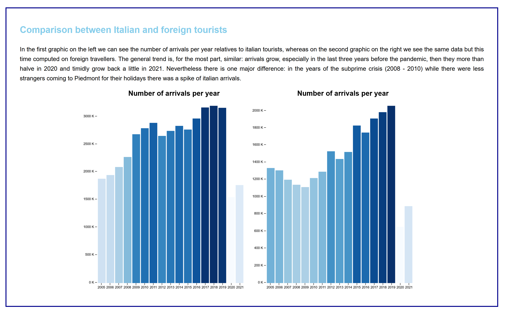
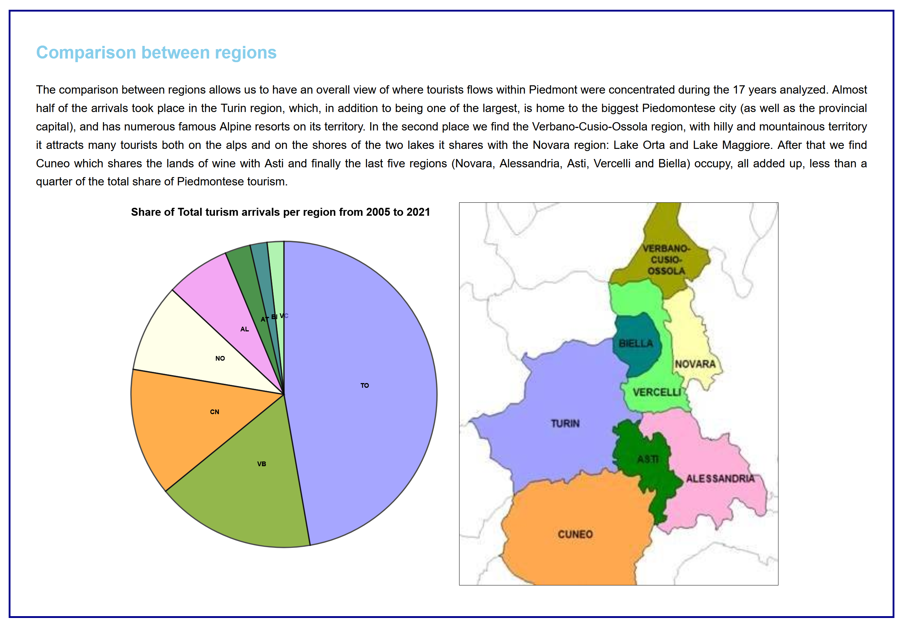

# Tourism in Piedmont from 2005 to 2021
## Data visualisation relative to Piedmont tourism trends from 2005 to 2021 made with D3.js
### [Clik here to see the document](https://francesco-tromellini.github.io/Piedmont_tourism_D3.js/)
## A database tale
This project aims to tell a story starting from a database, using web graphic representation technologies, in particular the D3.js library. This visualization was developed as part of the "Publication Numérique" course, held at UNIL by Isaac Pante open to students specializing in Computer Science for Human Sciences. The goal is to tell a story that is intuitively easy to understand and pleasant to watch starting from a public database taken, in this case, from the [official website of the Piedmont region](https://www.dati.piemonte.it/#/catalogodetail/regpie_ckan_ckan2_yucca_sdp_smartdatanet.it_Flussi_turistici_provincia_6054).
## Argumentative and graphic choices
I chose these data because they concern my native region, not the most famous (touristically speaking) in Italy, and concerns a topic that, on the one hand, has been very developed in the region in recent years, but on the other has suffered a strong setback due to the pandemic. \\
The graphic choices are theoretically inspired by the site [inormationisbetiful.net](https://informationisbeautiful.net/), which tells of databases in an original, creative and aesthetically sophisticated way, of which however I managed to reproduce the beauty in a very partial way. 
## How it is made
The page view is divided into four blocks corresponding to: 
* The presentation of the Data
* The Comparison between the arrivals of Italian and foreign tourists
* The global trend of Piedmont's turism
* The comparison between the eight regions inside Piedmont.
\\ Each block is visibly delimited and corresponds to a different chapter of the "narrative" such as the second in the image below. 

*Visualization example 1*

Sometimes, as in the image above, they contain visualizations of data and other times, as in the fourth point, they also contain images to better explain the context. 

*Visualization example 2*
## Packages
* [D3.js](https://d3js.org/)
